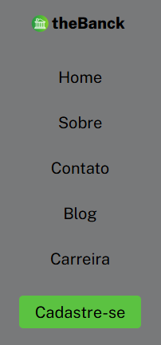
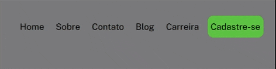

# Introdução

Este projeto foi um desafio imposto pelo curso DevQuesst com o intuito de usar pela primeira vez a ferramenta figma para nortear o projeto.

## App The Banck 

### Mobile

### Desktop

### Hover

## Tecnologias 

### HTML

O HTML usamos para formar o esqueleto do projeto, clasificando por tag's e classes para facilitar na hora de estilizarmos o site.

Foi usado uma tag nav para criar o menu e dentro da mesma foi criado uma formato de lista e então forçando-o a colocar em linha exatamente como em um menu de um site.

As tag's a usamos para colocar links para ter acesso as demais paginas do site.

### CSS

O CSS foi usado para estilizar, no figma foi fornecido toda a parte de estilização para o projeto.

Para colorir os elementos foi usado background-color e ao finalizar o projeto colocamos a função hover para dar uma animação quando usário passar com o mouse por cima do item a ser selecionado, e por fim fizemos ele resposivo para que pudesse ser usado em qualqeur tela sendo ela desktop ou mobile.

